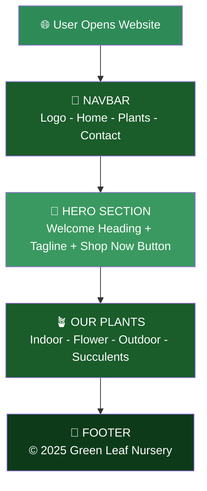

# 🌿 Green Leaf Nursery
> *Grow Green, Live Clean* — A simple plant nursery website built with HTML & CSS.

---

## 📁 Folder Structure
```
📁 plant-nursery/
   ├── 📄 index.html
   └── 🎨 style.css
```

---

## 🔄 Page Workflow


---

## 🛠️ Tech Stack

| Technology | Usage |
|------------|-------|
| HTML5      | Page structure & content |
| CSS3       | Styling & layout |

---

## ▶️ How to Run
1. Download the files
2. Open `index.html` in browser
3. Done! 🎉
